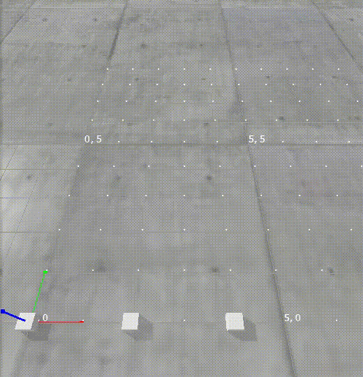

# Coordination and Execution of a Multi-Agent Path Finding (MAPF) plan

## Introduction
This repository implements coordination and execution of an MAPF plan.  


See [References](#references).

## Getting started

### Setup with uv

1. Install [uv](https://docs.astral.sh/uv/getting-started/installation/)

2. Install [vcs](https://github.com/dirk-thomas/vcstool)

3. Download the [deps.repos](https://gitlab.com/ROSI-AP/rmf2/mapf_execution/-/blob/feat/cf/rework/deps.repos) file 

4. Build

```
mkdir -p ~/colcon_extra_ws/src && cd ~/colcon_extra_ws
git clone https://github.com/colcon/colcon-python-project.git -b devel src/colcon-python-project
git clone https://github.com/Briancbn/colcon-python-project-uv.git -b feature/bn/manual-venv-activation src/colcon-python-project-uv
colcon build
. install/local_setup.sh


WORKSPACE_DIR="$HOME/mapf_ws"
REPOS_FILE="<path to .repos file>" 
mkdir -p $WORKSPACE_DIR/src
cd $WORKSPACE_DIR
vcs import --input $REPOS_FILE src
rosdep install --from-paths src -y --ignore-src

source ~/colcon_extra_ws/install/setup.sh; colcon venv sync; 
colcon build
```

## Usage

### Local demonstration



1. Run the pybullet simulation
```
cd $WORKSPACE_DIR
source ~/colcon_extra_ws/install/setup.sh; colcon venv sync;
cd $WORKSPACE_DIR/src/mapf_execution/packages/res_pybullet
uv run sim --coords "0,0 2,0"
```

2. Run the demonstration script
```
cd $WORKSPACE_DIR
source install/setup.sh; source install/activate.sh;
python3 src/res_ros2/res_ros2/res_ros2/test/integration.py
```

### Demonstration with ROS 2 nodes

1. Run the pybullet simulation
```
source ~/colcon_extra_ws/install/setup.sh; colcon venv sync;
cd src/res_mapf/res_mapf/packages/res_pybullet/
uv run sim --coords "0,0 2,0"
```

2. Run the ROS 2 plan server
```
source install/setup.sh; source install/activate.sh;
ros2 run res_ros2 plan_server_node
```

3. Then the ROS 2 plan executor
```
source install/setup.sh; source install/activate.sh;
ros2 run res_ros2 plan_executor_node
```

4. Send messages to onboard robots
```
ros2 topic pub -1 /robot_onboard res_ros2_msgs/RobotOnboard "robot_id: 'agent_0'
start_location: '0,0'"

ros2 topic pub -1 /robot_onboard res_ros2_msgs/RobotOnboard "robot_id: 'agent_1'
start_location: '2,0'"
```

5. Send initial tasks together
```
ros2 topic pub -1 /agent_0/task_request res_ros2_msgs/TaskRequest "task_id: 'agent_0_task'
robot_id: 'agent_0'
goal: '2,0'" &

ros2 topic pub -1 /agent_1/task_request res_ros2_msgs/TaskRequest "task_id: 'agent_1_task'
robot_id: 'agent_1'
goal: '0,0'"
```

6. Replace initial tasks with new ones to trigger replanning
```
ros2 topic pub -1 /agent_0/task_request res_ros2_msgs/TaskRequest "task_id: 'agent_0_task'
robot_id: 'agent_0'
goal: '1,2'" &

ros2 topic pub -1 /agent_1/task_request res_ros2_msgs/TaskRequest "task_id: 'agent_1_task'
robot_id: 'agent_1'
goal: '0,3'"
```


## Concept

1. A classical MAPF problem is solved with an MAPF solver. The solution is a list of positions that agents should move to at each timestep.
2. Plans are generated from the solution, capturing the dependencies between agent moves. An agent must vacate a location before another agent may move to that location.
3. A subclass that implements `BaseRobotController` defines how each move is to be executed.
4. Actions are queued for execution by the agents. As the actions are completed, or when replanning is required, plans are updated.
5. As agents receive new destinations, replanning occurs while other agents move, maintaining the dependencies. 

### Integration

1. Implement a subclass that implements `BaseRobotController` and defines how each agent's move action is to be executed.
    * A `SharedMemoryAgent` [example](packages/res_plan_execution/src/res_plan_execution/robot_controllers/shared_memory_agent_controller/agent_shmd_controller.py) is provided which communicates the commands and completion status by writing to a [SharedMemoryDict](https://github.com/luizalabs/shared-memory-dict)
2. Implement the `MAPFSolverABC` interface using a classical MAPF solver.


## References

The replanning process and committed vertices concept were based on the paper:

`W. Hönig, S. Kiesel, A. Tinka, J. W. Durham and N. Ayanian, "Persistent and Robust Execution of MAPF Schedules in Warehouses," in IEEE Robotics and Automation Letters, vol. 4, no. 2, pp. 1125-1131, April 2019, doi: 10.1109/LRA.2019.2894217.`


The [cbs](centralized/cbs) directory is from [multi_agent_path_planning](https://github.com/atb033/multi_agent_path_planning).

